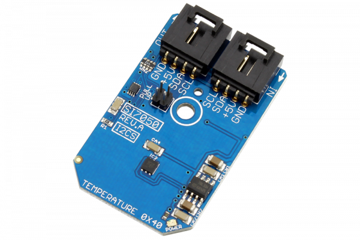

[](https://store.ncd.io/product/si7050-high-accuracy-temperature-sensor-%C2%B11-0c-i2c-mini-module/).

#  SI7050

The SI7050 is a high accuracy temperature sensor with a low power consumption.
This Device is available from www.ncd.io 

[SKU: SI7050]

(https://store.ncd.io/product/si7050-high-accuracy-temperature-sensor-%C2%B11-0c-i2c-mini-module/)
This Sample code can be used with Raspberry Pi.

Hardware needed to interface SI7050 temperature sensor With Raspberry Pi :
1. <a href="https://store.ncd.io/product/si7050-high-accuracy-temperature-sensor-%C2%B11-0c-i2c-mini-module/">SI7050 temperature sensor</a>
2.  <a href="https://store.ncd.io/product/i2c-shield-for-raspberry-pi-3-pi2-with-outward-facing-i2c-port-terminates-over-hdmi-port/">Raspberry Pi I2C Shield</a>
3. <a href="https://store.ncd.io/product/i%C2%B2c-cable/">I2C Cable</a>

## Python
Download and install smbus library on Raspberry pi. Steps to install smbus are provided at:

https://pypi.python.org/pypi/smbus-cffi/0.5.1

Download (or git pull) the code in pi. Run the program.

```cpp
$> python SI7050.py
```
The lib is a sample library, you will need to calibrate the sensor according to your application requirement.
